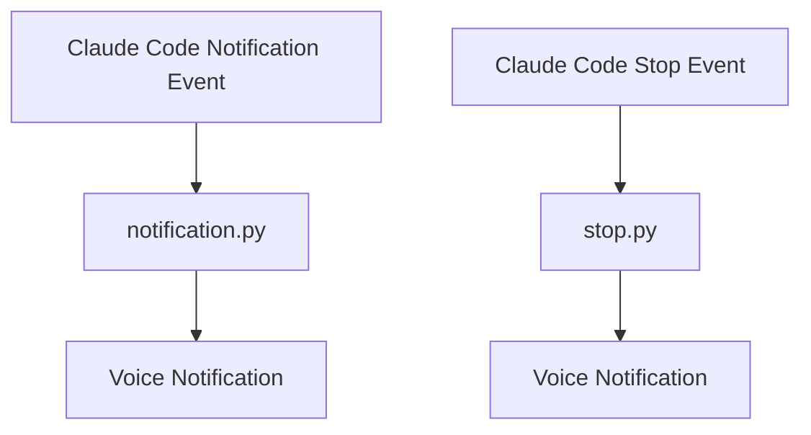

# 🤖 Claude Code Jarvis Hooks

> *"Sir, the code is polished and waiting—shall we embrace the future?"* - Enhance your Claude Code experience with intelligent voice notifications.

## 🎬 Demo

<div align="center">
  <a href="https://www.youtube.com/watch?v=5-75ju8RAG4">
    
  </a>
  <br><br>
  <strong>🎬 Watch the Demo: Claude Code with JARVIS-like Voice Notifications</strong>
  <br>
  <em>Experience enhanced development workflow with intelligent voice feedback</em>
</div>

---

## 🚀 What is Claude Code Jarvis?

Claude Code Jarvis is a sophisticated hook system that enhances your Claude Code CLI experience with intelligent voice notifications. Get spoken feedback when Claude needs your input with AI-generated messages and multiple TTS providers.

### ✨ Key Features

- 🎙️ **Voice Notifications** - Get spoken alerts when Claude needs your input
- 🎭 **AI-Generated Messages** - Witty, professional notification messages
- 🔄 **Multi-Provider TTS** - Works with ElevenLabs, OpenAI, and local TTS
- 📊 **Operation Logging** - Tracks notification events
- ⚡ **Seamless Integration** - Works transparently with Claude Code

## 🎯 Why Use Jarvis Hooks?

### Before Jarvis
- Silent CLI interactions
- No audio feedback when Claude needs input
- Generic notifications

### After Jarvis
- **"Sir, your expertise is needed"** 🔔
- **Voice notifications when Claude waits for input** 🎵
- **AI-generated witty notification messages** 🎭

## 🔧 Installation & Setup

### Prerequisites
- [Claude Code CLI](https://docs.anthropic.com/en/docs/claude-code)
- [uv](https://docs.astral.sh/uv/) (Python package manager)
- Python 3.8+

### Quick Start

1. **Clone the repository**
   ```bash
   git clone https://github.com/swapnildahiphale/claude-code-jarvis-hooks.git
   cd claude-code-jarvis-hooks
   ```

2. **Set up environment variables**
   ```bash
   cp .env.example .env
   # Edit .env with your API keys
   ```

3. **Configure your API keys**
   ```bash
   # Required for AI-generated messages
   CLAUDE_HOOKS_OPENAI_API_KEY=your_openai_api_key_here
   
   # Optional: For premium voice quality
   ELEVENLABS_API_KEY=your_elevenlabs_api_key_here
   ELEVENLABS_VOICE_ID=your_voice_id_here
   
   # Personalization
   ENGINEER_NAME=YourName
   ```

4. **Activate the hooks**
   ```bash
   # Copy this folder to your project's .claude directory
   # The hooks will automatically activate when using Claude Code
   ```

## 🎮 Usage

### Automatic Operation
Once installed, Jarvis hooks work automatically with Claude Code:

```bash
# Normal Claude Code usage
claude

# Jarvis automatically:
# ✅ Provides voice notifications when Claude needs input
# ✅ Generates AI-powered notification messages
# ✅ Handles stop events with voice feedback
```

### Manual Testing

```bash
# Test voice notifications
uv run .claude/hooks/utils/tts/elevenlabs_tts.py "Test message"

# Test AI message generation
uv run .claude/hooks/utils/llm/oai.py --completion
uv run .claude/hooks/utils/llm/oai.py --notification

# Test notification hook
uv run .claude/hooks/notification.py --notify
```

## 🏗️ Architecture

### Hook System


### Component Structure
```
.claude/
├── hooks/
│   ├── notification.py      # Voice notifications
│   ├── stop.py              # Stop event notifications
│   ├── subagent_stop.py     # Subagent stop notifications
│   └── utils/
│       ├── llm/             # AI message generation
│       │   ├── oai.py       # OpenAI integration
│       │   └── anth.py      # Anthropic fallback
│       └── tts/             # Text-to-speech
│           ├── elevenlabs_tts.py
│           ├── openai_tts.py
│           └── pyttsx3_tts.py
├── settings.json            # Hook configuration
```


## 🎨 AI-Generated Notifications

Jarvis generates sophisticated notification messages with:
- **Calm, articulate tone** with subtle Irish accent
- **Quietly confident** with gentle wit
- **Professional yet approachable** style
- **Precise diction** and poised pacing

### Sample Notification Messages
- *"Sir, your input is needed—lest I proceed without divine guidance."*
- *"Swapnil, your input is kindly requested—no pressure, Sir."*
- *"The code is polished and waiting—shall we embrace the future, Sir?"*
- *"All set, Swapnil—ready for whatever’s next with quiet confidence."*

## 📊 Logging & Monitoring

All operations are logged to `logs/`:
- `notification.json` - Voice notifications
- `stop.json` - Stop event notifications
- `chat.json` - Chat-related events

## 🛠️ Configuration

### Environment Variables
```bash
# Core Configuration
ENGINEER_NAME=YourName                    # For personalized messages
CLAUDE_HOOKS_OPENAI_API_KEY=sk-...        # OpenAI API key
CLAUDE_HOOKS_OPENAI_MODEL=gpt-4.1-nano   # Model selection

# Voice Configuration
ELEVENLABS_API_KEY=sk_...                 # ElevenLabs API key
ELEVENLABS_VOICE_ID=HzHW0uLdA9prFl1Z5krC # Voice selection
ELEVENLABS_MODEL_ID=eleven_turbo_v2_5     # Model selection
```

### Permissions
Configure allowed tools in `.claude/settings.json`:
```json
{
  "permissions": {
    "allow": [
      "Bash(mkdir:*)",
      "Bash(uv:*)",
      "Write",
      "Edit"
    ]
  }
}
```

## 🔄 Fallback System

Jarvis uses intelligent fallbacks:
1. **ElevenLabs TTS** (Premium quality) → 
2. **OpenAI TTS** (Good quality) → 
3. **pyttsx3** (Local, no API required)

## 🤝 Contributing

1. Fork the repository
2. Create your feature branch (`git checkout -b feature/amazing-feature`)
3. Commit your changes (`git commit -m 'Add amazing feature'`)
4. Push to the branch (`git push origin feature/amazing-feature`)
5. Open a Pull Request

## 📄 License

This project is licensed under the MIT License - see the [LICENSE](LICENSE) file for details.

## 🙏 Acknowledgments

- **Anthropic** for the amazing Claude Code CLI
- **OpenAI** for powering the AI personality
- **ElevenLabs** for premium voice synthesis
- **Iron Man** for the JARVIS inspiration

---

<div align="center">
  <h3>🚀 Ready to enhance your development workflow?</h3>
  <p><em>"Sir, your workspace awaits—shall we craft something remarkable?"</em></p>
</div>